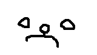

# ascii-api
Simple API to convert images to ASCII

### Notes during development

#### 23/11/2022

##### Example:
My initial implementation works for very simple images (think black and white `160x90` MS paint files), but not for anything else.

Using the character space of `"i+tXZ*W$` and the following source image:



This is the result we achieve:

```
$$$$$$$$$$$$$$$$$$$$$$$$$$$$$$$$$$$$$$$$$$$$$$$$$$$$$$$$$$$$$$$$$$$$$$$$$$$$$$$$$$$$$$$$$$$$$$$$$$$$$$$$$$$$$$$$$$$$$$$$
$$$$$$$$$$$$$$$$$$$$$$$$$$$$$$$$$$$$$$$$$$$$$$$$$$$$$$$$$$$$$$$$$$$$$$$$$$$$$$$$$$$$$$$$$$$$$$$$$$$$$$$$$$$$$$$$$$$$$$$$
$$$$$$$$$$$$$$$$$$$$$$$$$$$$$$$$$$$$$$$$$$$$$$$$$$$$$$$$$$$$$$$$$$$$$$$$$$$$$$$$$$$$$$$$$$$$$$$$$$$$$$$$$$$$$$$$$$$$$$$$
$$$$$$$$$$$$$$$$$$$$$$$$$$$$$$$$$$$$$$$$$$$$$$$$$$$$$$$$$$$$$$$$$$$$$$$$$$$$$$$$$$$$$$$$$$$$$$$$$$$$$$$$$$$$$$$$$$$$$$$$
$$$$$$$$$$$$$$$$$$$$$$$$$$$$$$$$$$$$$$$$$$$$$$$$$$$$$$$$$$$$$$$$$$$$$$$$$$$$$$$$$$$$$$$$$$$$$$$$$$$$$$$$$$$$$$$$$$$$$$$$
$$$$$$$$$$$$$$$$$$$$$$$$$$$$$$$$$$$$$$$$$$$$$$$$$$$$$$$$$$$$$$$$$$$$$$$$$$$$$$$$$$$$$$$$$$$$$$$$$$$$$$$$$$$$$$$$$$$$$$$$
$$$$$$$$$$$$$$$$$$$$$$$$$$$WWW***WWW$$$$$$$$$$$$$$$$$$$$$$$$$$$$$$$$$$$$$$$$$$$$$$$$$$$$$$$$$$$$$$$$$$$$$$$$$$$$$$$$$$$$
$$$$$$$$$$$$$$$$$$$$$$$$***"""``````***$$$$$$$$$$$$$$$$$$$$$$$$$$$$$$$$$$$$$$$ZZZtttZZZ$$$$$$$$$$$$$$$$$$$$$$$$$$$$$$$$$
$$$$$$$$$$$$$$$$$$$$$***```+++WWW"""ZZZ$$$$$$$$$$$$$$$$$$$$$$$$$$$$$$$$$WWWttt```iii"""+++WWW$$$$$$$$$$$$$$$$$$$$$$$$$$$
$$$$$$$$$$$$$$$$$$$$$iii```***$$$"""ZZZ$$$$$$$$$$$$ZZZtttZZZWWW$$$$$$$$$ZZZ```***$$$WWW"""+++WWW$$$$$$$$$$$$$$$$$$$$$$$$
$$$$$$$$$$$$$$$$$$$$$***+++```"""```ZZZ$$$$$$$$$XXX```+++```ttt$$$$$$$$$ZZZ```+++WWWWWWZZZ```WWW$$$$$$$$$$$$$$$$$$$$$$$$
$$$$$$$$$$$$$$$$$$$$$$$$$$$***ZZZZZZWWW$$$$$$$$$"""XXX$$$++++++$$$$$$$$$WWW***"""""""""""""""WWW$$$$$$$$$$$$$$$$$$$$$$$$
$$$$$$$$$$$$$$$$$$$$$$$$$$$$$$$$$$$$$$$$$$$$$$$$ttt```+++```XXX$$$$$$$$$$$$$$$WWWWWWWWWWWWWWW$$$$$$$$$$$$$$$$$$$$$$$$$$$
$$$$$$$$$$$$$$$$$$$$$$$$$$$$$$$$$$$$WWW************+++```XXXWWW$$$$$$$$$$$$$$$$$$$$$$$$$$$$$$$$$$$$$$$$$$$$$$$$$$$$$$$$$
$$$$$$$$$$$$$$$$$$$$$$$$$$$$$$***+++```"""""""""""""""```""""""iii***$$$$$$$$$$$$$$$$$$$$$$$$$$$$$$$$$$$$$$$$$$$$$$$$$$$
$$$$$$$$$$$$$$$$$$$$$$$$$$$$$$+++"""ZZZWWWWWWWWWWWWWWW*********ttt```ZZZ$$$$$$$$$$$$$$$$$$$$$$$$$$$$$$$$$$$$$$$$$$$$$$$$
$$$$$$$$$$$$$$$$$$$$$$$$$$$$$$ZZZZZZ$$$$$$$$$$$$$$$$$$$$$$$$$$$$$$ttt```WWW$$$$$$$$$$$$$$$$$$$$$$$$$$$$$$$$$$$$$$$$$$$$$
$$$$$$$$$$$$$$$$$$$$$$$$$$$$$$$$$$$$$$$$$$$$$$$$$$$$$$$$$$$$$$$$$$WWW"""ZZZ$$$$$$$$$$$$$$$$$$$$$$$$$$$$$$$$$$$$$$$$$$$$$
$$$$$$$$$$$$$$$$$$$$$$$$$$$$$$$$$$$$$$$$$$$$$$$$$$$$$$$$$$$$$$$$$$$$$iiiZZZ$$$$$$$$$$$$$$$$$$$$$$$$$$$$$$$$$$$$$$$$$$$$$
$$$$$$$$$$$$$$$$$$$$$$$$$$$$$$$$$$$$$$$$$$$$$$$$$$$$$$$$$$$$$$$$$$$$$WWWWWW$$$$$$$$$$$$$$$$$$$$$$$$$$$$$$$$$$$$$$$$$$$$$
$$$$$$$$$$$$$$$$$$$$$$$$$$$$$$$$$$$$$$$$$$$$$$$$$$$$$$$$$$$$$$$$$$$$$$$$$$$$$$$$$$$$$$$$$$$$$$$$$$$$$$$$$$$$$$$$$$$$$$$$
$$$$$$$$$$$$$$$$$$$$$$$$$$$$$$$$$$$$$$$$$$$$$$$$$$$$$$$$$$$$$$$$$$$$$$$$$$$$$$$$$$$$$$$$$$$$$$$$$$$$$$$$$$$$$$$$$$$$$$$$

```

##### Improvements:

As it is right now, the things that need more work are:

- A way to formalize output. Visualizing the terminal output generally does not work and copying the result to a text editor and using word wrap is clunky. The proposal is to send the result to a file with a max width/height, for viewing purposes.
- Again, regarding the width/height of the resulting image, find a better way of resizing any file that comes in. Perhaps this needs two steps: One to make it smaller and easier to deal with, and one to output the result to something that makes sense. Filtering methods are important to take into account.
- Images are currently stretched, because of the pixel/char size discrepancy. We need a way to make char representations more "square". Right now each character is written 3 times to compensate (`255` becomes `$` becomes `$$$`).
- Experiment with pixel-to-char conversions. The current one is `(R+G+B)/3`, but perhaps it's not the best one.
- Determine how to read file colors. I believe black and white images do not benefit from the previous pixel-to-char function.
- Testing. Much of these small improvements + file validation need testing.
